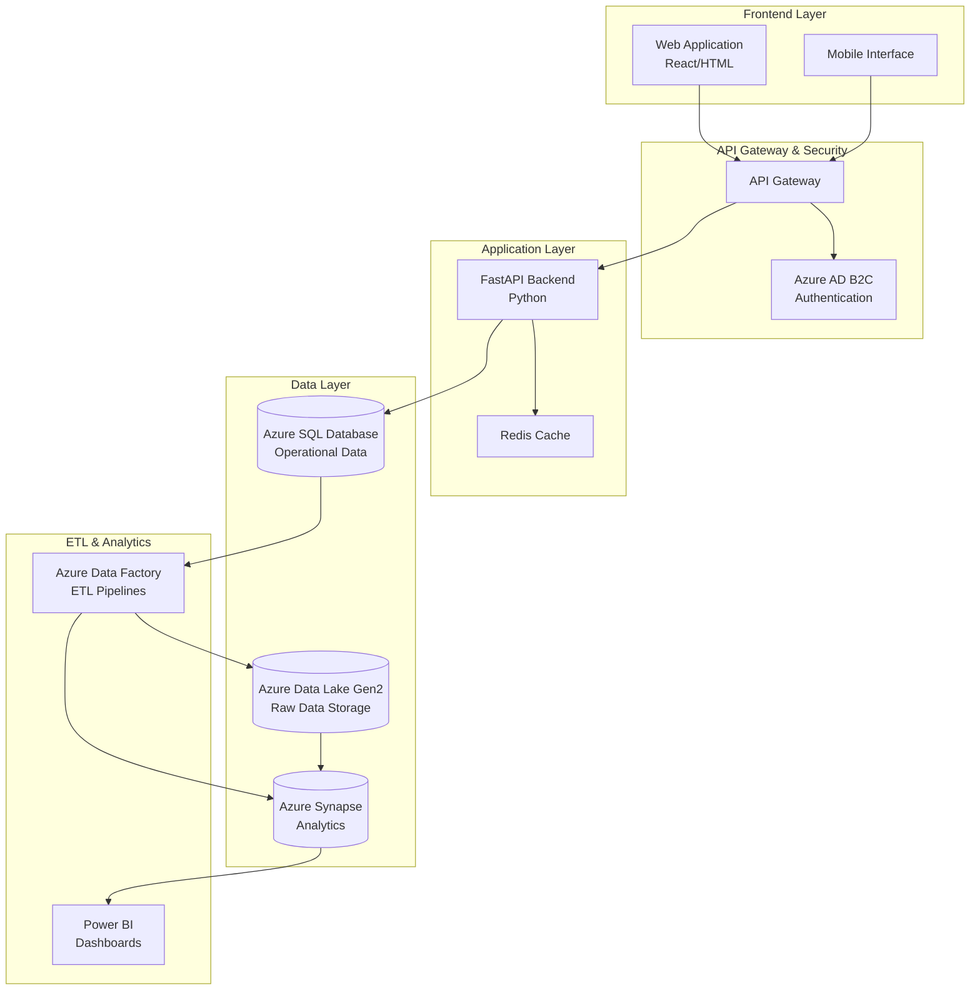

# Design Document

## Overview

The Hospital Management System is designed as a modern, cloud-native application leveraging Azure services for scalability, security, and advanced analytics. The system follows a microservices-oriented architecture with clear separation between operational data management and analytical workloads.

The core architecture consists of:
- **Frontend Layer**: Web interface for different user roles
- **API Layer**: FastAPI-based REST services for business logic
- **Data Layer**: Azure SQL for operational data, Azure Synapse for analytics
- **Analytics Layer**: Power BI dashboards connected to Synapse Analytics
- **Security Layer**: Azure AD integration with RBAC

## Architecture



## Components and Interfaces

### 1. Patient Management Service

**Responsibilities:**
- Patient registration and profile management
- Medical record storage and retrieval
- Patient search and filtering

**Key Interfaces:**
```python
class PatientService:
    def create_patient(patient_data: PatientModel) -> PatientResponse
    def get_patient(patient_id: str) -> PatientModel
    def update_patient(patient_id: str, updates: dict) -> PatientResponse
    def search_patients(criteria: SearchCriteria) -> List[PatientModel]
```

### 2. Appointment Management Service

**Responsibilities:**
- Doctor schedule management
- Appointment booking and modification
- Availability checking and conflict resolution

**Key Interfaces:**
```python
class AppointmentService:
    def create_appointment(appointment_data: AppointmentModel) -> AppointmentResponse
    def get_doctor_schedule(doctor_id: str, date_range: DateRange) -> ScheduleModel
    def update_appointment_status(appointment_id: str, status: AppointmentStatus) -> bool
    def check_availability(doctor_id: str, datetime: datetime) -> bool
```

### 3. Resource Management Service

**Responsibilities:**
- Hospital resource tracking (rooms, equipment, beds)
- Resource allocation and availability management
- Resource utilization reporting

**Key Interfaces:**
```python
class ResourceService:
    def create_resource(resource_data: ResourceModel) -> ResourceResponse
    def assign_resource(resource_id: str, patient_id: str) -> AssignmentResponse
    def release_resource(resource_id: str) -> bool
    def get_available_resources(resource_type: str) -> List[ResourceModel]
```

### 4. Analytics Service

**Responsibilities:**
- Data aggregation for reporting
- Integration with Azure Synapse
- Real-time metrics calculation

**Key Interfaces:**
```python
class AnalyticsService:
    def get_doctor_utilization(date_range: DateRange) -> UtilizationReport
    def get_appointment_trends() -> TrendReport
    def get_resource_usage_stats() -> ResourceUsageReport
    def trigger_etl_pipeline() -> PipelineStatus
```

## Data Models

### Core Operational Models (Azure SQL)

```sql
-- Patients Table
CREATE TABLE Patients (
    PatientID UNIQUEIDENTIFIER PRIMARY KEY DEFAULT NEWID(),
    FirstName NVARCHAR(50) NOT NULL,
    LastName NVARCHAR(50) NOT NULL,
    DateOfBirth DATE NOT NULL,
    Gender NVARCHAR(10),
    PhoneNumber NVARCHAR(20),
    Email NVARCHAR(100),
    Address NVARCHAR(500),
    EmergencyContact NVARCHAR(200),
    CreatedAt DATETIME2 DEFAULT GETUTCDATE(),
    UpdatedAt DATETIME2 DEFAULT GETUTCDATE(),
    IsActive BIT DEFAULT 1
);

-- Doctors Table
CREATE TABLE Doctors (
    DoctorID UNIQUEIDENTIFIER PRIMARY KEY DEFAULT NEWID(),
    FirstName NVARCHAR(50) NOT NULL,
    LastName NVARCHAR(50) NOT NULL,
    Specialization NVARCHAR(100) NOT NULL,
    LicenseNumber NVARCHAR(50) UNIQUE NOT NULL,
    PhoneNumber NVARCHAR(20),
    Email NVARCHAR(100),
    Department NVARCHAR(100),
    IsActive BIT DEFAULT 1,
    CreatedAt DATETIME2 DEFAULT GETUTCDATE()
);

-- Appointments Table
CREATE TABLE Appointments (
    AppointmentID UNIQUEIDENTIFIER PRIMARY KEY DEFAULT NEWID(),
    PatientID UNIQUEIDENTIFIER NOT NULL,
    DoctorID UNIQUEIDENTIFIER NOT NULL,
    AppointmentDateTime DATETIME2 NOT NULL,
    Duration INT DEFAULT 30, -- minutes
    Status NVARCHAR(20) DEFAULT 'Scheduled',
    Notes NVARCHAR(1000),
    CreatedAt DATETIME2 DEFAULT GETUTCDATE(),
    UpdatedAt DATETIME2 DEFAULT GETUTCDATE(),
    FOREIGN KEY (PatientID) REFERENCES Patients(PatientID),
    FOREIGN KEY (DoctorID) REFERENCES Doctors(DoctorID)
);

-- Hospital Resources Table
CREATE TABLE HospitalResources (
    ResourceID UNIQUEIDENTIFIER PRIMARY KEY DEFAULT NEWID(),
    ResourceName NVARCHAR(100) NOT NULL,
    ResourceType NVARCHAR(50) NOT NULL, -- 'Room', 'Equipment', 'Bed'
    Location NVARCHAR(100),
    Status NVARCHAR(20) DEFAULT 'Available', -- 'Available', 'Occupied', 'Maintenance'
    AssignedToPatientID UNIQUEIDENTIFIER NULL,
    AssignedAt DATETIME2 NULL,
    CreatedAt DATETIME2 DEFAULT GETUTCDATE(),
    FOREIGN KEY (AssignedToPatientID) REFERENCES Patients(PatientID)
);

-- Doctor Schedules Table
CREATE TABLE DoctorSchedules (
    ScheduleID UNIQUEIDENTIFIER PRIMARY KEY DEFAULT NEWID(),
    DoctorID UNIQUEIDENTIFIER NOT NULL,
    DayOfWeek INT NOT NULL, -- 0=Sunday, 1=Monday, etc.
    StartTime TIME NOT NULL,
    EndTime TIME NOT NULL,
    IsActive BIT DEFAULT 1,
    FOREIGN KEY (DoctorID) REFERENCES Doctors(DoctorID)
);
```

### Analytics Models (Azure Synapse)

```sql
-- Fact Tables for Analytics
CREATE TABLE FactAppointments (
    AppointmentKey BIGINT IDENTITY(1,1) PRIMARY KEY,
    PatientKey BIGINT,
    DoctorKey BIGINT,
    DateKey INT,
    TimeKey INT,
    Duration INT,
    Status NVARCHAR(20),
    WaitTime INT,
    ShowStatus NVARCHAR(20)
);

CREATE TABLE FactResourceUtilization (
    UtilizationKey BIGINT IDENTITY(1,1) PRIMARY KEY,
    ResourceKey BIGINT,
    DateKey INT,
    UtilizationHours DECIMAL(5,2),
    OccupancyRate DECIMAL(5,4)
);

-- Dimension Tables
CREATE TABLE DimDoctor (
    DoctorKey BIGINT IDENTITY(1,1) PRIMARY KEY,
    DoctorID UNIQUEIDENTIFIER,
    FullName NVARCHAR(100),
    Specialization NVARCHAR(100),
    Department NVARCHAR(100)
);

CREATE TABLE DimPatient (
    PatientKey BIGINT IDENTITY(1,1) PRIMARY KEY,
    PatientID UNIQUEIDENTIFIER,
    AgeGroup NVARCHAR(20),
    Gender NVARCHAR(10)
);
```

## Error Handling

### Error Response Structure
```python
class ErrorResponse(BaseModel):
    error_code: str
    message: str
    details: Optional[dict] = None
    timestamp: datetime
    request_id: str
```

### Error Categories

1. **Validation Errors (400)**
   - Invalid patient data format
   - Missing required fields
   - Invalid date/time formats

2. **Business Logic Errors (422)**
   - Doctor not available for appointment
   - Resource already assigned
   - Appointment conflicts

3. **Authentication/Authorization Errors (401/403)**
   - Invalid JWT token
   - Insufficient permissions
   - Expired session

4. **System Errors (500)**
   - Database connection failures
   - Azure service unavailability
   - ETL pipeline failures

### Error Handling Strategy
- Implement global exception handlers in FastAPI
- Log all errors with correlation IDs for tracing
- Return user-friendly error messages
- Implement circuit breaker pattern for external service calls
- Use retry mechanisms for transient failures

## Testing Strategy

### Unit Testing
- **Framework**: pytest for Python backend
- **Coverage Target**: 90% code coverage
- **Focus Areas**:
  - Business logic validation
  - Data model operations
  - Service layer functionality
  - Error handling scenarios

### Integration Testing
- **Database Integration**: Test with Azure SQL test database
- **API Integration**: Test REST endpoints with test client
- **External Services**: Mock Azure services for testing
- **ETL Testing**: Validate data transformation logic

### End-to-End Testing
- **User Journey Testing**: Complete workflows from UI to database
- **Performance Testing**: Load testing with realistic data volumes
- **Security Testing**: Authentication and authorization flows
- **Analytics Testing**: Validate Synapse data pipeline accuracy

### Test Data Management
- Use factory pattern for test data generation
- Implement database seeding for consistent test environments
- Create anonymized production data subsets for testing
- Automated test data cleanup after test execution

### Continuous Testing
- Automated test execution in CI/CD pipeline
- Integration with Azure DevOps for test reporting
- Performance regression testing
- Security vulnerability scanning